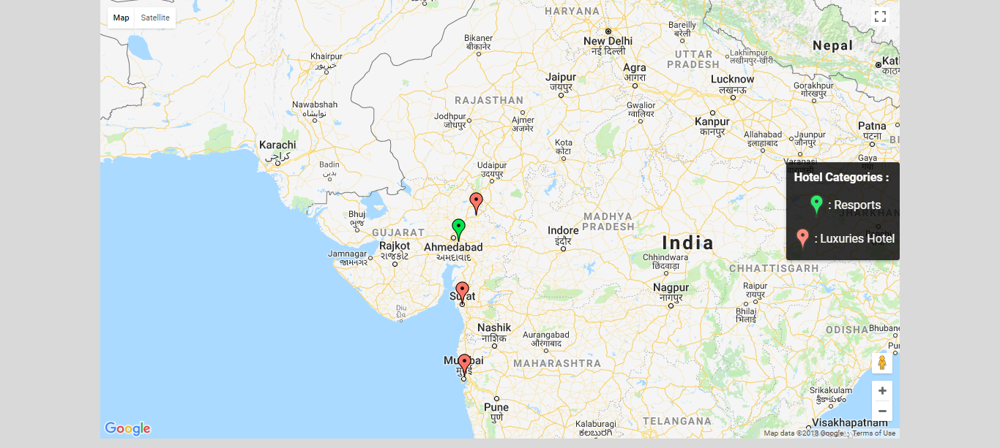
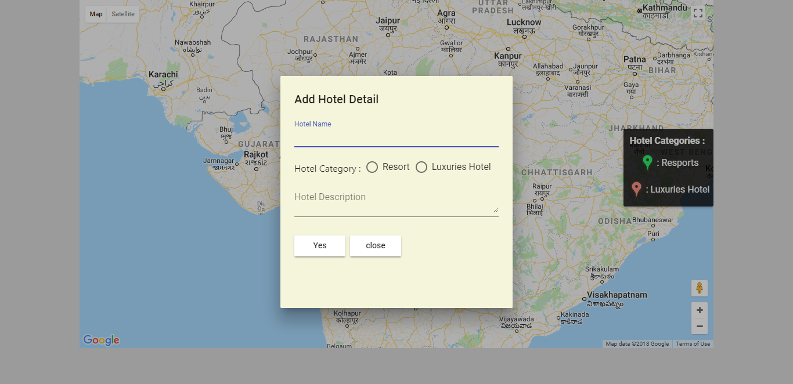
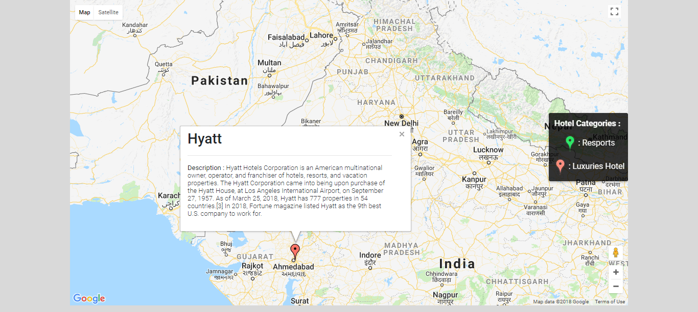

# Angular-Map-Example

Demo Example helps developer to know how to integrate Google Maps and play around with its events.It also describes how to create custom control and Info windows in Google map.

Angular Map Example is built using Angular 4, Google Map API and Angular Material .

Functionalities :
1) Display markers of differnt hotel and onclick of marker show relevent information
2) Add Hotel Infromation and Marker on map by double clicking on map at perticular hotel location
3) Custom control on map which states category description of hotel and its relevent marker icon

Here is images of each functionality :
####                     Custom control & Hotels displayed on Map

####                       After double click on Map,Popup Dialog to add hotel

####                        Information of Hotel on click of Marker

To run Demo, clone the repository. and follow below steps :
1) npm install
2) npm run build
3) npm start

and browse http://localhost:4200/ in your browser.
